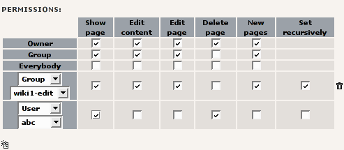
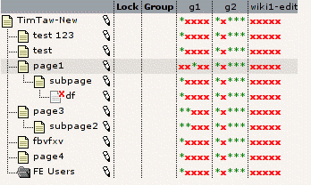
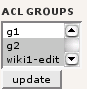

# TYPO3 Extension be_acl

## What does it do?

Until now, the access scheme for the TYPO3 backend was the traditional User-Group-World scheme known from Unix. This, however, is not sufficent when more complex permissions are needed, for example when wanting to apply different permissions to different groups on the same page. Another issue in the current permission system is that the page owners/groups are set to the user and the main group of that user who creates the page.

This are the two scenarios the ACLs want to solve. It is now possible to define on a per-group and per-user basis for pages which permissions are active. ACLs allow pages to have permissions for more than one user/group on a page.

Furthermore, ACLs can work recursively, meaning an ACL doesn't need to be copied to all subpages when it should apply there as well. This makes handling permissions easier.

## Screenshots



This is how the edit permission screen works. As the ACLs work transparently, there is no noticeable difference in TYPO3 except in the Web->Access-Module. Beneath the table, you see the “Add ACL” button.



You can see the permissions for each group where there is an ACL set here. This screen shows you for example that there is a new ACL on “page1” for the group “g1” (because the permissions change there.)



There is a new user/group selector in the “Permissions” view which can be found in Web->Access. With these selectors it is possible to define which groups and users should be shown in the matrix. This makes especially bigger matrices easier to handle.

## Users manual

To create a new ACL, open the web->access module and edit the page permissions as usually. You will notice a small “new”-icon under the table. Click the icon and a new ACL appears.

You have to choose now if you want to create a user ACL or a group ACL. After that, select the user/group in the other selectorbox you want to create the ACL for. The permissions work as usual. 

### Recursive

The “recursive” flag needs special mentioning, because it works different compared to the standard TYPO3 behavior.

In the above example (see the second screenshot), the pages “TimTaw-New” and “page3” have an ACL applied which works recursively for group g1. “page1” has a single ACL, not working recursively. This means on all subpages of page1, the ACL from TimTaw-New applies. In the above example, there is also one ACL defined for g2.

As a default, the recursive ACL works for all pages under that page until another ACL for the same user/group is found. This means that on page “test”, the ACL from “TimTaw-new” is applied. On “page3” and subpage, the ACL from “timTaw-New” is not taken into account because the ACL from “page3” is active there.

Because the ACL on “page1” is non-recursive, it overrides the ACL from “timTaw-new” for that page, but not for subpages. On “subpage”, the ACL from “TimTaw-New” is applied. This makes it possible to create schemes disallowing special things just for a certain “protected” page.

## Adminstration

Nothing to administer. Just install the extension.

When installing the extension, you have the possibility to switch the current “old” permission management on or off. When switching it off, remember that you have to add some ACLs for your user groups, or nobody except administrators can edit the data anymore.

There is a new option for the extension in the extension manager called enableFilterSelector. If you enable this option, you will see a box where you can select the visible users/groups in the permission matrix to make this view easier to handle.

The extension is for TYPO3 3.8 and up, because there are two hooks necessary which are only in the core in these versions and up. If you use an older version, you need to patch the core.

The hooks used are the following:

```php
$TYPO3_CONF_VARS['SC_OPTIONS']['t3lib/class.t3lib_userauthgroup.php']['calcPerms']
$TYPO3_CONF_VARS['SC_OPTIONS']['t3lib/class.t3lib_userauthgroup.php']['getPagePermsClause']
```

be_acl supports the Caching Framework for storing the access lists for editors to increase the performance. The default entries are:

```php
$GLOBALS['TYPO3_CONF_VARS']['SYS']['caching']['cacheConfigurations']['tx_be_acl_timestamp'] = [
    'frontend' => 'TYPO3\\CMS\\Core\\Cache\\Frontend\\StringFrontend',
    'backend' => 'TYPO3\\CMS\\Core\\Cache\\Backend\\SimpleFileBackend',
];

$GLOBALS['TYPO3_CONF_VARS']['SYS']['caching']['cacheConfigurations']['tx_be_acl_permissions'] = [
    'frontend' => 'TYPO3\\CMS\\Core\\Cache\\Frontend\\VariableFrontend',
    'backend' => 'TYPO3\\CMS\\Core\\Cache\\Backend\\SimpleFileBackend',
];
```

### Tips and tricks for large websites (approx. more than 1000 pages)

The last version of be_acl features some improvements for large page trees which makes be_acl usable in these environments. It especially adds some session caching for the ACL computations.

We have seen two bottlenecks when dealing with large installations: Creating content elements and editing page settings. (These are the processes which take longest).

The performance decreases with the number of subpages an ACL has. So, if you specify an ACL for every group on the root page, your performance can very likely be improved a lot.

We suggest that for these scenarios, you combine the “old” permission system with the ACL system: For global settings (everything you would do with ACLs on the root page) use the old permission system, and use ACLs only for parts of the pagetree (f.e. to give departments write access to their part of the pagetree).

## Configuration

Nothing to configure here.

## Known problems

Try to avoid ACLs on the root page which include several thousand of subpages.

## To-Do list

Currently none

## Changelog

### 0.2.0
* first version

### 0.2.1
* fixed a bug

### 0.3.0

* fixed a major bug concerning a user being in multiple groups.
* Interface improvements

### 1.0.0

* interface improvements, possible selector for groups/users in matrix view – this makes them easier to handle (it is possible to activate/deactivate it while installing)

### 1.6.0

* version for Typo3 7.6. Complete refactoring. Many thanks to Todd Hossack and Alexander Stehlik for their contributions.
